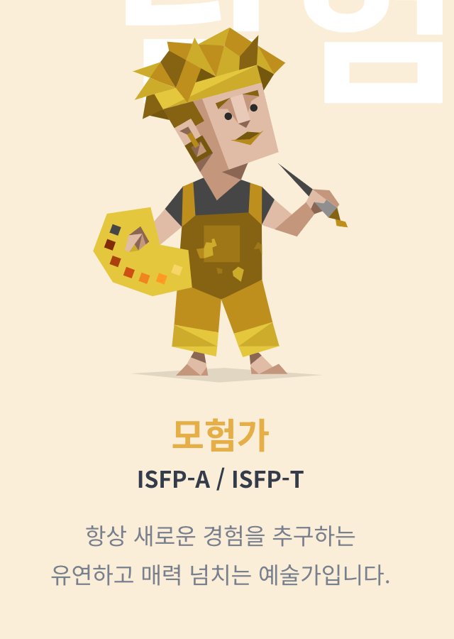
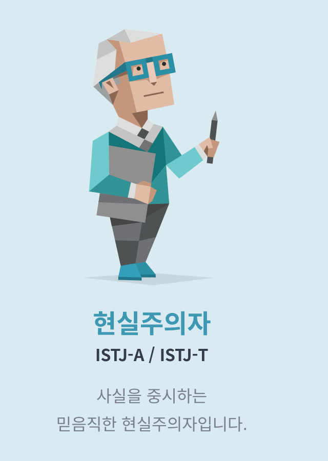
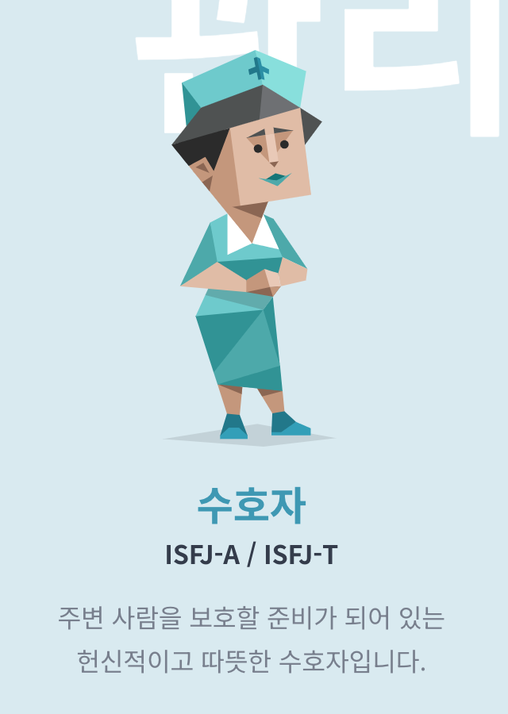
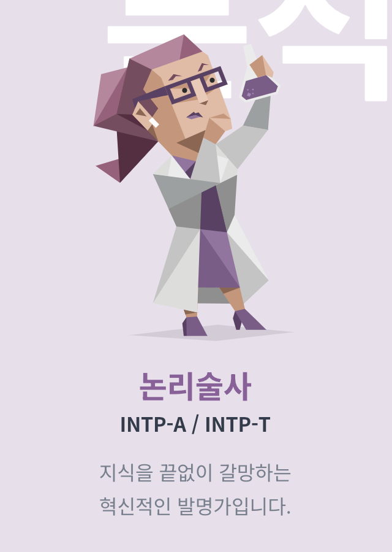
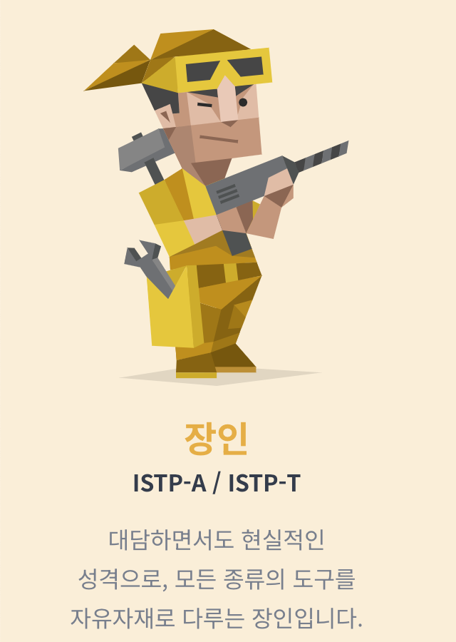
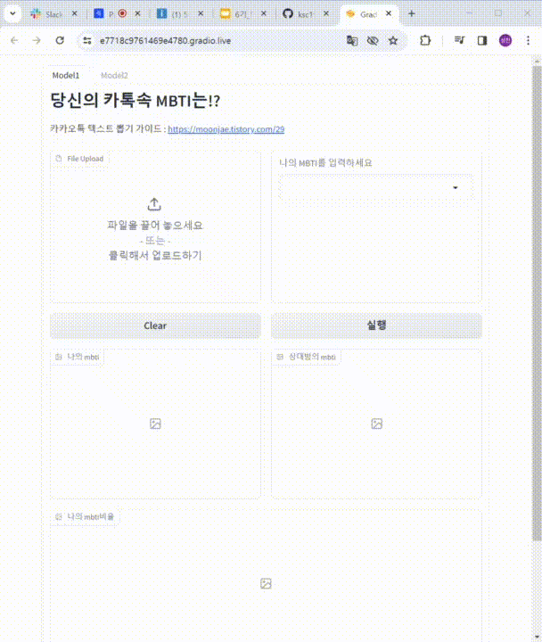
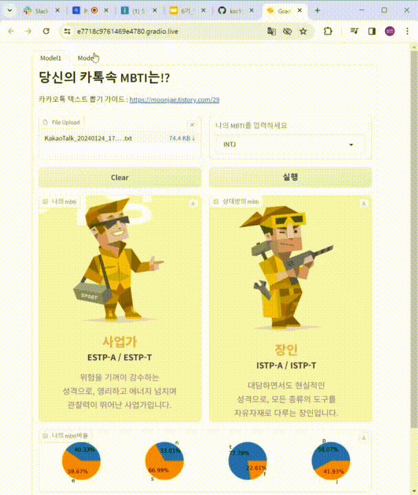

# Programmers-AI-6-5
# 아이즈(6조) : LLM를 이용한 MBTI 분류 및 텍스트 추천

## 팀 소개
<table>
 <tr>
    <td align="center"></td>
    <td align="center"></td>
    <td align="center"></td>
    <td align="center"></td>
    <td align="center"></td>
    <td align="center"></td>
  </tr>
  <tr>
    <td align="center"><a href="https://github.com/jooniorp"><b>팀장 박준희</b></td>
    <td align="center"><a href="https://github.com/ksc1583"><b>팀원 김성찬</b></td>
    <td align="center"><a href="https://github.com/jjkk-story"><b>팀원 김정경</b></td>
    <td align="center"><a href="https://github.com/TonyLee8596"><b>팀원 이동기</b></td>
    <td align="center"><a href="https://github.com/LJMoonCode"><b>팀원 이재문</b></td>
    <td align="center"><a href="https://github.com/jhs36"><b>팀원 정희상</b></td>
  </tr>
  <tr> 
    <td align="center">프로젝트 관리, 모델 테스트</td>
    <td align="center">분류 모델 구현, 모델 테스트</td>
    <td align="center">데이터 전처리, DB 생성, 관리</td>
    <td align="center">재생성 모델 구현, api관리</td>
    <td align="center">분류 모델학습, 모델 테스트</td>
    <td align="center">DB 관리, 프롬프츠 엔지니어링</td>
  </tr>

</table>
 

## 프로젝트 소개

BERT기반 한국어 언어모델인 Kcbert를 활용하여 사용자의 채팅 데이터로 사용자와 상대방의 MBTI를 분류하고, ChatGPT api를 활용하여 사용자가 문장을 작성하고, 원하는 MBTI를 선택하면 그 MBTI말투에 맞게 문장을 재생성해줍니다.
***

<h1>📚 OUR STACKS</h1>

✔️programming env & tool

✔️Frond-end

✔️Back-end

  
## 모델 학습

### 1. 사용한 언어모델

- KcBERT 
Kcbert는 Korean comments BERT의 줄임말로 한국어 댓글을 이용하여 학습한 BERT 모델입니다.
해당 모델은 2019.01.01 ~ 2020.06.15 사이에 작성된 뉴스 기사들의 댓글과 대댓글을 수집한 데이터 셋을 통해 학습되었습니다. 
[kcbert 깃허브](https://github.com/Beomi/KcBERT)

- gpt-3.5-turbo 
ChatGPT는 OpenAI가 개발한 프로토타입 대화형 인공지능 챗봇이다.

### 2. 학습데이터

- 네이버 MBTI 심리 카페 특정 게시판 (사랑방 게시판, 신변 잡기 게시판) 의 게시글 중 닉네임으로부터 MBTI를 유추할 수 있는 데이터  https://github.com/dev-jaemin/Korean-MBTI-Conversation-Dataset?tab=readme-ov-file 8~512자 사이의 데이터만 추출, 맞춤법 검사 및 띄어쓰기 수정, 이모지 제거, null 제거, 중복값 제거

- 유튜브 MBTI 인사이드  EP.1 ~ EP.6 MBTI가 다른 16명의 사람들이 4박 5일동안 한 공간에서 생활하는 프로그램 스크립트 데이터  https://www.youtube.com/watch?v=VxnvTBH8yg4
 8~512자 사이의 데이터만 추출, 맞춤법 검사 및 띄어쓰기 수정, null 제거, 중복값 제거

- MBTI별 카카오톡 오픈 채팅방 채팅 데이터
8~512자 사이의 데이터만 추출, null 제거, 중복값 제거

## 모델 구현

### 프로젝트 개발 환경 및 구조

  

### MBTI분류모델

복잡한 검사 대신 카카오톡 대화내용을 기반으로 간단하게 상대방과 자신의 MBTI 파악하기 위함이며 대화의 상대방이 누군지에 따라 달라지는 자신의 MBTI를 확인할 수 있습니다.

  

*카카오톡 데이터는 대화내용 내보내기를 통해 텍스트 파일로 가져올 수 있습니다.

### 문장 재생성 모델

Chat GPT api를 활용하여 사용자가 문장을 작성하고, 원하는 MBTI를 선택하면 그 MBTI말투에 맞게 문장을 재생성해줍니다. 
총 5개의 재생성 문장을 추천하고 그 중에 하나를 선택해서 사용하면 됩니다. 
예측된 상대방의 MBTI를 기반으로 대화를 원활하게 하며 더 나은 소통을 위함입니다.

  

## 디렉토리

[Model training & fine tuning](https://github.com/ksc1583/Programmers-AI-6-5/blob/9e9bebc5e49c50711e7670589b30e2e4a688ba84/kc_bert_large.py) : Kcbert모델을 MBTI가 태깅된 데이터로 학습 및 파인튜닝 
[app.py](https://github.com/ksc1583/Programmers-AI-6-5/blob/9e9bebc5e49c50711e7670589b30e2e4a688ba84/app.py) : 모델1,2 통합 웹 서비스 코드 
[textfile_to_dict_30](https://github.com/ksc1583/Programmers-AI-6-5/blob/9e9bebc5e49c50711e7670589b30e2e4a688ba84/textfile_to_dict_30.py) : 사용자가 업로드한 채팅 텍스트 파일 처리 코드 
[save to mongo](https://github.com/ksc1583/Programmers-AI-6-5/blob/9e9bebc5e49c50711e7670589b30e2e4a688ba84/save_to_mongodb.py) : 입력된 텍스트 데이터를 DB에 저장하는 코드 
[read dataset](https://github.com/ksc1583/Programmers-AI-6-5/blob/9e9bebc5e49c50711e7670589b30e2e4a688ba84/read_last_dataset_db_to_csv.py) : 모델에 재학습 시킬 데이터를 가져오는 코드 
[update model](https://github.com/ksc1583/Programmers-AI-6-5/blob/9e9bebc5e49c50711e7670589b30e2e4a688ba84/update_model.py) : 새로운 데이터로 모델 파라미터 업데이트 하는 코드 
[Data preprocessing](https://github.com/ksc1583/Programmers-AI-6-5/tree/9e9bebc5e49c50711e7670589b30e2e4a688ba84/data_preprocessing) : 데이터 전처리 코드 폴더 
[Dataset](https://github.com/ksc1583/Programmers-AI-6-5/tree/9e9bebc5e49c50711e7670589b30e2e4a688ba84/data_set) : 모델 학습에 쓰인 데이터셋 폴더 
[mbti img](https://github.com/ksc1583/Programmers-AI-6-5/tree/9e9bebc5e49c50711e7670589b30e2e4a688ba84/img_mbti) : 웹사이트에 나타낼 mbti 이미지 폴더 

## 한계점 및 향후 해결방안
MBTI가 제대로 라벨링된 대화 형식의 데이터셋이 없으며 
MBTI가 라벨링된 데이터는 일반적인 소재의 대화 내용이 아닌 MBTI와 관련된 대화 내용이다 
따라서 Kcbert모델을 파인튜닝하고 학습하는 데에 있어 16가지의 MBTI를 분류하거나 정확도를 측정하기에 데이터가 적고 부정확하다 
또한, 성격이란 것의 기준 자체가 애매모호하고 명확하게 구분할 수 있는 정의가 없기 때문에 mbti 분류task자체가 굉장히 높은 정확도를 가지기 어려운 task이다.
 
하지만, 모델 파라미터를 주기적으로 업데이트 하는 코드를 작성하여 구현함으로 채팅데이터가 점점 쌓이면 더 정확한 분류를 할 수 있음이 기대되고
기존의 mbti검사보다 시간이 훨씬 단축되고 효율적으로 자신의 mbti를 대략적으로 확인할 수 있는 방법이라 생각된다.
